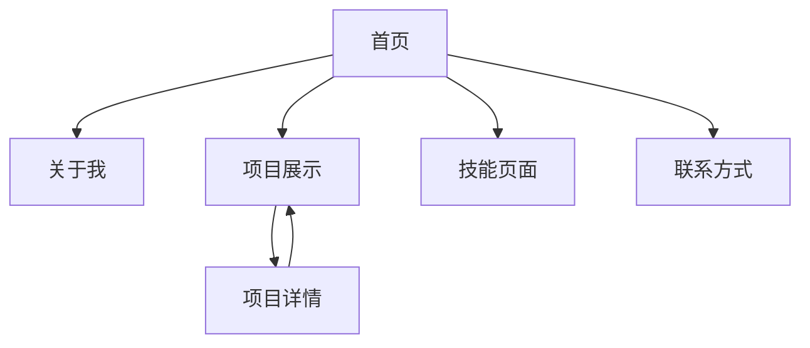

## 1. 产品概述
基于Shengxin Xiao简历的个人作品集网站，展示专业技能、项目经验和个人信息。网站将托管在GitHub Pages上，为潜在雇主和合作伙伴提供专业形象展示。

## 2. 核心功能

### 2.1 用户角色
无需用户注册，所有访客均可浏览网站内容。

### 2.2 功能模块
个人作品集网站包含以下主要页面：
1. **首页**：个人简介、技能概览、导航菜单
2. **关于我**：详细个人信息、教育背景、联系方式
3. **项目展示**：项目列表、项目详情、技术栈展示
4. **技能页面**：技术技能分类、熟练度展示
5. **联系方式**：社交媒体链接、邮箱联系

### 2.3 页面详情
| 页面名称 | 模块名称 | 功能描述 |
|-----------|-------------|-------------|
| 首页 | 个人简介 | 展示姓名、职位、简短自我介绍 |
| 首页 | 技能概览 | 展示核心技术栈和关键技能 |
| 首页 | 导航菜单 | 提供页面间跳转功能 |
| 关于我 | 个人信息 | 展示详细个人背景、教育经历 |
| 关于我 | 联系方式 | 提供邮箱、LinkedIn等联系方式 |
| 项目展示 | 项目列表 | 展示所有项目卡片，包含项目名称和简介 |
| 项目展示 | 项目详情 | 点击项目卡片显示详细项目信息 |
| 技能页面 | 技能分类 | 按类别展示技术技能 |
| 技能页面 | 熟练度展示 | 用进度条或图表展示技能熟练度 |
| 联系方式 | 社交媒体 | 展示GitHub、LinkedIn等社交链接 |
| 联系方式 | 邮箱联系 | 提供一键复制邮箱功能 |

## 3. 核心流程
访客访问网站后，可以从首页浏览个人简介和技能概览，通过导航菜单跳转到其他页面了解详细信息。在项目展示页面可以查看具体项目详情，在联系方式页面可以找到各种联系方式。

## 4. 用户界面设计

### 4.1 设计风格
- **主色调**：深蓝色 (#1a365d) 和白色 (#ffffff)
- **辅助色**：浅灰色 (#f7fafc) 和橙色 (#ed8936)
- **按钮样式**：圆角矩形，悬停效果
- **字体**：Sans-serif 字体，标题 24-32px，正文 16px
- **布局风格**：现代化卡片式布局，顶部固定导航栏
- **图标风格**：使用简洁的线性图标

### 4.2 页面设计概览
| 页面名称 | 模块名称 | UI元素 |
|-----------|-------------|-------------|
| 首页 | 个人简介 | 大字体姓名，职位标签，简短描述文字，背景渐变效果 |
| 首页 | 技能概览 | 技能标签云，悬停放大效果，响应式网格布局 |
| 项目展示 | 项目列表 | 卡片式布局，项目缩略图，标题和简介，悬停阴影效果 |
| 项目详情 | 详细信息 | 模态框或新页面展示，包含项目截图、技术栈、职责描述 |
| 技能页面 | 技能分类 | 分类标题，技能列表，进度条展示熟练度 |

### 4.3 响应式设计
采用桌面优先设计，适配移动端显示。导航栏在小屏幕下转换为汉堡菜单，内容区域采用弹性布局确保在不同设备上的良好展示效果。