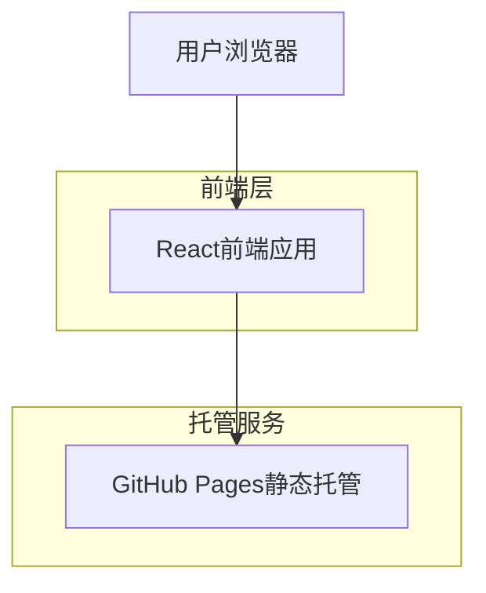

## 1. 架构设计



## 2. 技术描述
- **前端**: React@18 + tailwindcss@3 + vite
- **初始化工具**: vite-init
- **后端**: 无（静态网站）
- **部署**: GitHub Pages

## 3. 路由定义
| 路由 | 用途 |
|-------|---------|
| / | 首页，展示个人简介和技能概览 |
| /about | 关于我页面，详细个人信息和联系方式 |
| /projects | 项目展示页面，列出所有项目 |
| /skills | 技能页面，展示技术技能分类和熟练度 |
| /contact | 联系方式页面，社交媒体链接和邮箱 |

## 4. 项目结构
```
src/
├── components/          # 可复用组件
│   ├── Header.jsx     # 导航栏组件
│   ├── Footer.jsx     # 页脚组件
│   ├── ProjectCard.jsx # 项目卡片组件
│   └── SkillBar.jsx   # 技能进度条组件
├── pages/              # 页面组件
│   ├── Home.jsx       # 首页
│   ├── About.jsx      # 关于我页面
│   ├── Projects.jsx   # 项目展示页面
│   ├── Skills.jsx     # 技能页面
│   └── Contact.jsx    # 联系方式页面
├── data/               # 静态数据
│   ├── projects.json  # 项目数据
│   ├── skills.json    # 技能数据
│   └── personal.json  # 个人信息
├── styles/             # 样式文件
│   └── globals.css    # 全局样式
└── App.jsx            # 主应用组件
```

## 5. 数据模型
由于这是一个静态展示网站，数据将以JSON格式存储在本地文件中：

### 个人信息数据结构
```json
{
  "name": "Shengxin Xiao",
  "title": "Software Engineer",
  "bio": "Passionate developer with expertise in full-stack development",
  "education": {
    "degree": "Bachelor of Science",
    "major": "Computer Science",
    "university": "University Name",
    "year": "2020"
  },
  "contact": {
    "email": "shengxin.xiao@example.com",
    "linkedin": "linkedin.com/in/shengxinxiao",
    "github": "github.com/Leionel"
  }
}
```

### 项目数据结构
```json
[
  {
    "id": 1,
    "name": "Project Name",
    "description": "Project description",
    "technologies": ["React", "Node.js", "MongoDB"],
    "image": "/images/project1.jpg",
    "github": "https://github.com/Leionel/project1",
    "demo": "https://project1.demo.com"
  }
]
```

### 技能数据结构
```json
[
  {
    "category": "Frontend",
    "skills": [
      {"name": "React", "level": 90},
      {"name": "JavaScript", "level": 85},
      {"name": "HTML/CSS", "level": 95}
    ]
  }
]
```

## 6. 部署配置
GitHub Pages部署配置：

### vite.config.js
```javascript
export default {
  base: '/Leionel.github.io/',
  build: {
    outDir: 'dist'
  }
}
```

### package.json脚本
```json
{
  "scripts": {
    "dev": "vite",
    "build": "vite build",
    "preview": "vite preview",
    "deploy": "npm run build && gh-pages -d dist"
  }
}
```

## 7. 性能优化
- 使用React.lazy进行代码分割
- 图片懒加载和压缩
- CSS和JS文件压缩
- 使用CDN加速静态资源